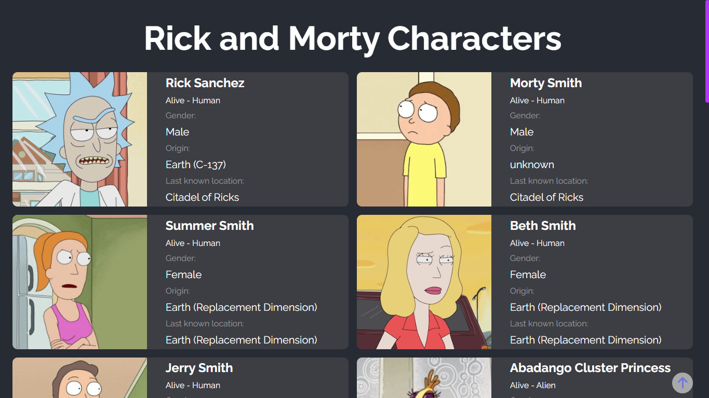
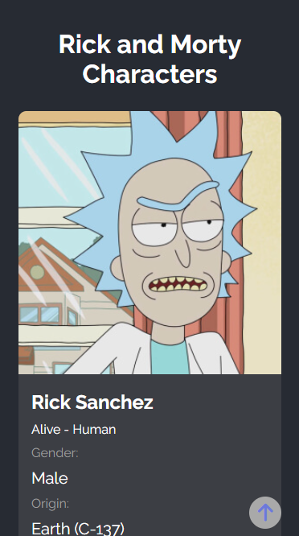

# Rick and Morty Characters

Projeto desenvolvido com o intuito de mostrar a listagem de personagens da série de animação ***Rick and Morty*** utilizando a API [The Rick and Morty API](https://rickandmortyapi.com/)

🔗 [Clique aqui para acessar](https://douglaspfeffer.github.io/rick-and-morty/)

### Tecnologias 💻

## Para Desktop

## Para Mobile

##

Feito com 💙 por <a href="https://github.com/douglaspfeffer">Douglas Pfeffer</a>.
